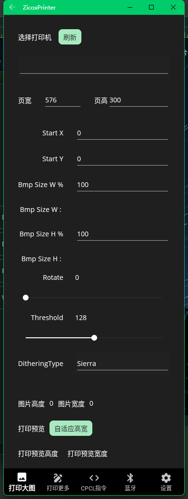
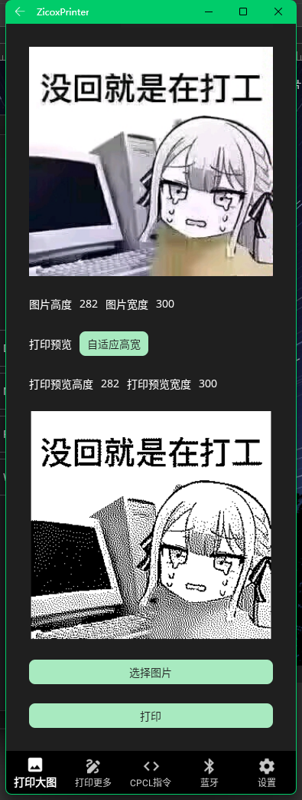
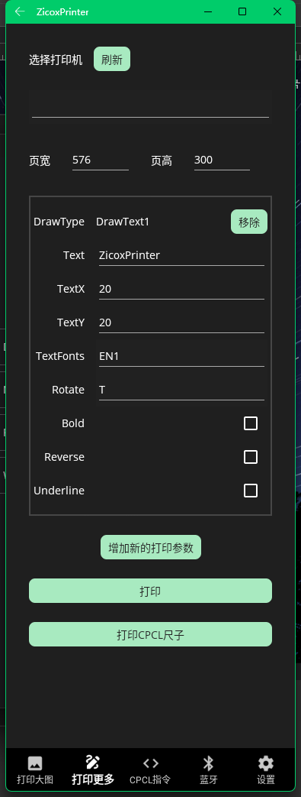
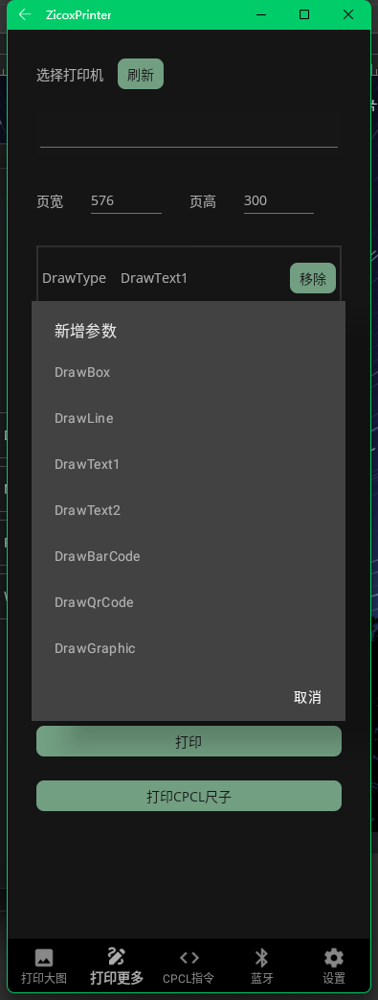
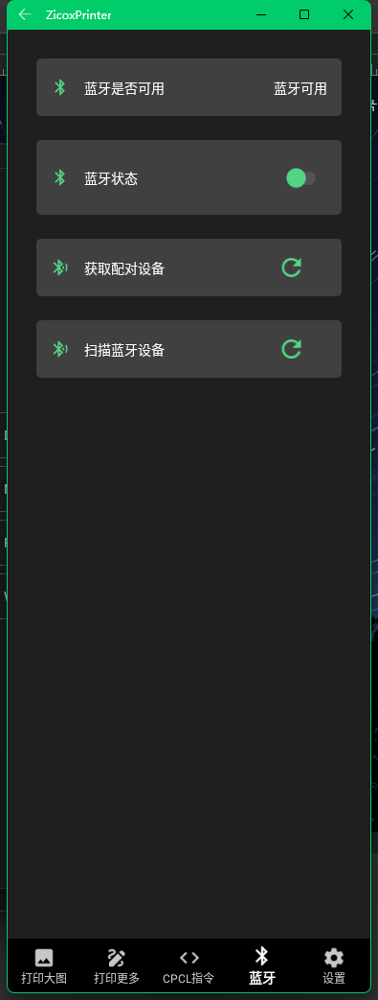
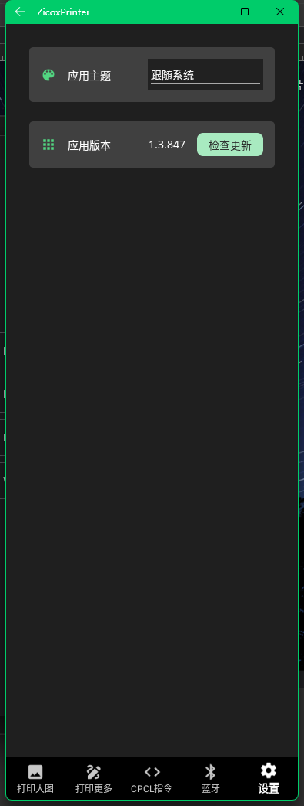

# ZicoxPrinter

使用 .Net Core MAUI 开发的 Zicox CPCL打印机App
<br/>Using .Net Core MAUI develop Zicox CPCL printer App

- 安卓设备的系统要求 / System requirements for Android devices
    - 安卓版本 >= Android 5.0 (API 21 Lollipop)
    <br/>Android version >= Android 5.0 (API 21 Lollipop)

- 使用.Net MAUI开发，限制了平台为 Windows 和 安卓。
  <br/>Developed using .Net MAUI, the platforms are limited to Windows and Android.

- 参照Zicox CPCL打印机的SDK制作的简易的CPCL打印程序
  <br/>A simple CPCL printing program made with reference to the Zicox CPCL printer SDK

## 测试用到的设备 / Tested devices

### Android 设备 / Android devices

- ```WSA (Windows Subsystem for Android) 2311.400000.5.0```
- ```Sony XQ-BQ72 (Android 13)```
- ```Sony XQ-DQ72 (Android 14)``` 
- ```UROVO DT50DQ72 (Android 11)``` 

### Zicox 设备 / Zicox devices

- ```Zicox CC3```
- ```注意```，目前仅在 ```Zicox CC3 打印机```上进行过完整的功能测试
  <br/>```Note```, currently full functional testing has only been carried out on ```Zicox CC3 printer```
- 按照Zicox官方说明，理论上可以在Zicox的其它使用CPCL指令的打印机上进行使用
  <br/>According to Zicox official instructions, it can theoretically be used on other Zicox printers that use CPCL instructions.

## App 截图 / Screenshot

<table>
  <tr>
    <td align="center">
      
    </td>
    <td align="center">
      
    </td>
    <td align="center">
      
    </td>
  </tr>
  <tr>
    <td align="center">
      
    </td>
    <td align="center">
      
    </td>
    <td align="center">
      同时包含有所有的可打印参数 / Include all available print parameters
      <br/>
      Box / Line / Text / Barcode / QR Code / Image
      <br/>
      
    </td>
  </tr>
  <tr>
    <td align="center">
      
    </td>
    <td align="center">
      
    </td>
    <!-- <td align="center">
      
    </td> -->
  </tr>
</table>

- 打印CPCL标尺 / Print CPCL ruler
  <br/>


## 项目说明 / Project description

- [```ZicoxPrinter```](ZicoxPrinter)
    - 使用 ```.Net Core``` ```MAUI``` 开发的Android App 
    <br/>An Android App developed using ```.Net Core``` ```MAUI```

- [```MyZpSDK```](AndroidSoure/MyApplication/MyZpSDK)
    - 自行二次封装的Zicox CPCL SDK，并加入了一些自定义的功能
    <br/>Self-packaged Zicox CPCL SDK and added some custom functions

    - 基础的Zicox CPCL SDK是Zicox官方提供的 [```zp_cpcl_new_打印通用版大图片.jar```](AndroidSoure/MyApplication/MyZpSDK/libs/zp_cpcl_new_common_bigimage.jar)
    <br/>The basic Zicox CPCL SDK is the Zicox official provided [```zp_cpcl_new_打印通用版大图片.jar```](AndroidSoure/MyApplication/MyZpSDK/libs/zp_cpcl_new_common_bigimage.jar)

    - 因为是.Net Core MAUI的项目，故还需要再次通过[ .Net 的安卓绑定库](MyZpSDK)封装成.Net可使用的类库
    <br/>Because it is a .Net Core MAUI project, it needs to be packaged into a .Net usable class library through [.Net Android binding library](MyZpSDK) again.

- [```MyBluetoothLibrary```](AndroidSoure/MyApplication/mybluetoothlibrary)
    - 自行编写的安卓蓝牙简易功能库，仅支持经典蓝牙的搜索与配对功能，不支持蓝牙数据的传输相关的功能
    <br/>The self-written Android Bluetooth simple function library only supports search and pairing functions of classic Bluetooth and does not support functions related to Bluetooth data transmission.
    
    - 因为主要是在安卓平台上使用，且目前并没有符合我预期功能的简易蓝牙功能库，所以才自行编写了单独的安卓蓝牙功能库，并再次通过[ .Net 的安卓绑定库](MyBluetoothLibrary)封装成.Net可使用的类库
    <br/>Because it is mainly used on the Android platform, and there is currently no simple Bluetooth function library that meets my expected functions, so I wrote a separate Android Bluetooth function library by myself, and again passed [.Net Android binding library](MyBluetoothLibrary) Encapsulated into a .Net usable class library
